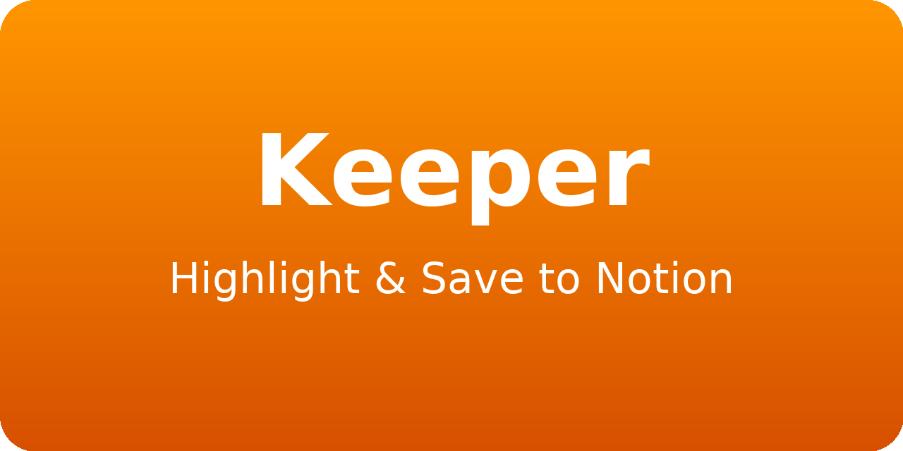

<p align="center">
  
</p>

# Keeper – Notion Highlighter

Keeper is a Chrome/Edge extension that lets you **capture highlights** from any webpage and send them directly to a Notion database along with the page URL, capture timestamp, and a per-selection **Project** tag.

- Captures **Content**, **URL**, **Date Captured**, and **Project**
- One-click from the context menu (right-click) or `Ctrl/⌘ + Shift + Y`
- Change the current **Project** anytime from the popup
- Modular code with a tiny, testable Notion client
- Chrome & Edge (Manifest V3)

> Your Notion database must contain the following properties (exact names and types):
>
> | Name          | Type       |
> |---------------|------------|
> | Content       | text       |
> | URL           | url        |
> | Date Captured | date       |
> | Project       | text       |
>
> The database must also have a single **title** property (any name; the extension auto-detects it).

---

## Install (unpacked)

1. Download/unzip the project.
2. Open **chrome://extensions** (or **edge://extensions**).
3. Enable **Developer mode**.
4. Click **Load unpacked** and select the project folder.

The extension adds a context menu item **“Save selection to Notion”** and a toolbar popup to set the **Project**.

---

## Connect to Notion

You have two options. OAuth is the most user-friendly; Internal token is fastest for personal use.

### A) OAuth (recommended)

1. Create a **Public** Notion integration (Notion → **My integrations**).
2. Load the extension, then note your extension ID from **chrome://extensions**.  
   Construct the redirect URI:  
   `https://<extension-id>.chromiumapp.org/notion`
3. In your Notion integration settings:
   - Set the **Redirect URI** above.
   - Copy **OAuth Client ID** and **Authorization URL**.
4. Deploy the tiny **token-exchange worker** (see `serverless/worker-cloudflare.js`) to Cloudflare Workers (or any server).  
   Configure **environment secrets** on the worker:
   - `NOTION_CLIENT_ID`
   - `NOTION_CLIENT_SECRET`
5. Open the extension **Options** and fill:
   - **OAuth Client ID**
   - **Authorization URL**
   - **Token Exchange Endpoint URL** (your worker’s base URL)
6. Click **Sign in & Authorize**, complete Notion’s consent, then **Refresh list** and **select your database**.

### B) Internal Token (simplest)

1. Create an **Internal** Notion integration and copy the **Internal Integration Token**.
2. In Notion, open your target database → **••• → Add connections** → add your integration.
3. In the extension **Options**, paste the token into **Internal Integration Token**, click **Refresh list**, and **select your database**.

---

## Using the extension

- Select text on any page → **Right-click → Save selection to Notion**  
  or use the keyboard shortcut **`Ctrl/⌘ + Shift + Y`**.
- Use the toolbar **popup** to set the current **Project** (persists across saves).
- **Title vs Content** behavior:
  - **Title** uses the **page/tab title** (or falls back to the first 80 chars of the selection).
  - **Content** uses the **full selection** (chunked to stay within Notion limits).

---

## Files / Structure

- `manifest.json` — MV3 manifest (service worker as ES module)
- `background.js` — context menu, keyboard shortcut, messaging, auth routing
- `src/notionClient.js` — small Notion REST client (`/search`, `/databases/{id}`, `/pages`) + pure helpers
- `src/oauth.js` — builds OAuth URL; parses the authorization redirect
- `src/storage.js` — wrapper around `chrome.storage.sync`
- `options.html` / `options.js` — onboarding for OAuth or Internal token; database picker
- `popup.html` / `popup.js` — project name control + last save status
- `serverless/worker-cloudflare.js` — minimal token-exchange endpoint (keeps client_secret off the extension)
- `tests/helpers.test.js` — small Vitest suite (pure helpers only)
- `package.json` — dev deps and test script

---

## Testing

```bash
npm install
npm test
```

---

## Troubleshooting

- **“Property does not exist”**: ensure your DB has **Content (rich_text)**, **URL (url)**, **Date Captured (date)**, **Project (rich_text)** with exact names.
- **No databases visible**: after creating your integration, **Add connections** on the database (Notion UI).
- **OAuth loops / state mismatch**: open Options → clear OAuth fields → save → sign in again.
- **Title equals Content**: you’re on the latest build — Title uses page title; Content uses full selection. Reload the extension if you edited code.

---

## License

MIT

---
